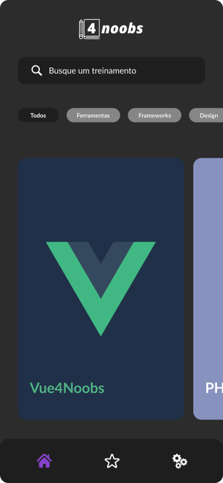
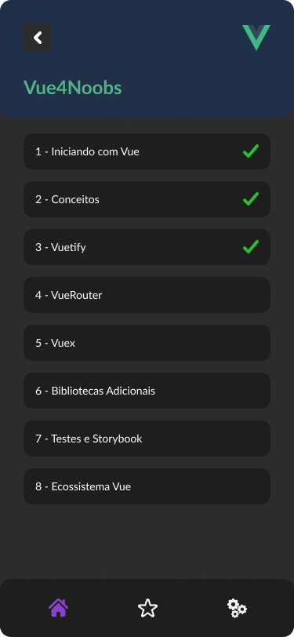
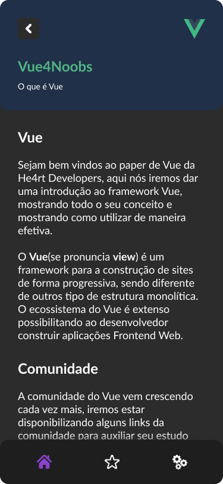

<h1 align="center">
  
</h1>

<h2 align="center">
  4noobs - Mobile
</h2>

<h6 align="center">You can also check the english version <a href="README.en-US.md">here</a>.</h6>

  

  

  

  

O <strong>4Noobs Mobile</strong> é uma extensão do repositório <strong>4Noobs</strong> no Github que busca facilitar os estudos de pessoas que buscam conhecimento na area de tecnologia. Com cursos gratuitos feitos pela comunidade e para comunidade, esse aplicativo busca seguir a filosofia: feito pela comunidade para a comunidade de forma gratuita e com o intuito de evoluirmos nosso conhecimento.

  
  
  
  

  <a href="https://www.figma.com/file/TFnYLZ5GkWywneNoSH0bof/4noobs-App?node-id=0%3A1">Projeto no Figma</a>

---

## 🔖 Índice

<ul>
  <li>
    <a href="#-instalação">Instalação</a>
    <ul>
      <li><a href="#-requisitos">Requisitos</a></li>
      <li><a href="#-clone">Clone</a></li>
      <li><a href="#-setup">Setup</a></li>
    </ul>
  </li>
  <li>
    <a href="#-funcionalidades">Funcionalidades</a>
    <ul>
      <li><a href="#-documentacao">Documentação</a></li>
      <li><a href="#-feito-com">Feito Com</a></li>
    </ul>
  </li>
  <li><a href="#-contribuição">Contribuição</a></li>
  <li><a href="#-apoio">Apoio</a></li>
  <li><a href="#-licença">Licença</a></li>
</ul>

---

## 🚀 Instalação

### 📜 Requisitos

Para rodar qualquer aplicação feita em React Native você precisa configurar o Ambiente de Desenvolvimento na sua máquina. Você pode verificar a documentação oficial [aqui](https://reactnative.dev/docs/environment-setup).

- [ ] Trabalho em progresso...

### 👯 Clone

- Clone esse repositório para sua máquina local:

`https://github.com/Rychillie/4noobs-mobile`

### 🎛 Setup

#### Android

- `$ react-native run-android`

#### iOS - _Apenas no MAC_

- `cd ios && pod install && cd ..`

- `react-native run-ios`

---

## 📋 Funcionalidades

### 📖 Documentação

- [ ] Trabalho em progresso...

### 🛠 Feito com

- [React Native](https://reactnative.dev/) - Um framework para construir aplicações nativas com React.
- [Expo](https://expo.io/) - Expo é uma plataforma de código livre para criar aplicações nativas para Android, iOS e web utilizando JavaScript e React.

---

## 🤔 Contribuição

> Para começar...

### Passo 1

- 🍴 Faça um Fork desse repositório!

### Passo 2

- 👯 Clone esse repositório para sua máquina local executando `git clone https://github.com/Rychillie/4noobs-mobile.git`

### Passo 3

- 🎋 Crie uma branch de feature executando `git checkout -b my-feature`

### Passo 4

- ✅ Faça commit com as suas mudanças executando `git commit -m 'feat: My new feature'`;

### Passo 5

- 📌 Faça o Push para da branch executando `git push origin my-feature`;

### Passo 6

- 🔃 Crie um novo Pull Request

Depois que for feito o merge do seu Pull Request, você pode deletar a branch de feature.

---

## 📌 Apoio

Entre em contato comigo em qualquer uma das minhas redes!

- Me encontre [aqui](https://alll.ink/Rychillie) 👈

---

## 📝 Licença

Este projeto está licenciado sob a licença MIT - consulte o arquivo [LICENSE](LICENSE) para obter detalhes.

---

Feito com ♥ Aproveite!
